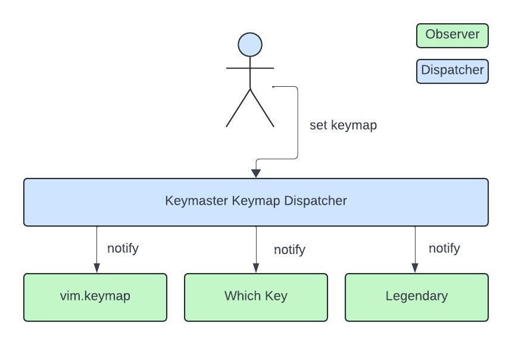

# 🔑 Keymaster.nvim

> [!WARNING]
> This plugin is abandoned.
>
> Turns out it wasn’t a good idea. The benefit of having a single interface is
> dwarfed by its drawbacks:
>
> - The interface is something that needs to be learned, and it’s not that
>   easy with lazy observer shenanigans.
> - The interface is something that needs to be maintained.
> - The interface is something that needs to adapt to downstream changes.
>   Which Key completely revamped its interface while this plugin existed.
> - Turns out, often I just want to different settings in Legendary and Which
>   Key.
>
> The cost of this plugin was bigger than just using WK and Legendary directly.

_The keymapping solution for the modular age._

Keymaster is a Neovim plugin that provides an extendable keymap _dispatcher_. The
_dispatcher_ implements [an observer pattern
interface](https://en.wikipedia.org/wiki/Observer_pattern), which lets
config and plugin authors create cleaner and more maintainable Lua. The
benefits of using Keymaster as the keymapping interface include the following:

- As a Neovim config writer, your keymap observers, like [Which Key] or
  [Legendary], become decoupled. Your [Legendary] setup will not break just
  because you turn off [Which Key].
- As a config writer, you dynamically add or remove keymap observers without
  changing your existing keymaps. A new plugin comes out that indexes keymaps?
  Just add an _observer_ for it.
- As a config writer, you can more easily lazy load your keymap-related plugins.
  Keymaster comes with utilities for storing and replaying keymap-setting
  events until you are ready to initialize your plugins.
- As a plugin author, you no longer need to provide specialized integrations to
  all other keymap-related plugins. Just implement a simple _observer_ for your
  plugin.



## ⚡️ Requirements

- Neovim 0.9+
- Optional plugin dependencies:
  - [Legendary]
  - [Which Key]

## 📦 Installation

Install the plugin with your preferred package manager, such as [Lazy]:

```lua
{
  [1] = "gregorias/keymaster.nvim",
  config = true,
}
```

## 🚀 Usage

## 🍳 Cookbook

### Lazy loading Legendary

Here is an example configuration of a lazy loading [Legendary] that is
compatible with Keymaster.

```lua
keymaster_on_lazy_load = nil
legendary_config = {
  [1] = "mrjones2014/legendary.nvim",
  cmd = "Legendary",
  init = function()
    -- This makes sure that we’ll register all keymap events until the load.
    keymaster_on_lazy_load = require("keymaster").add_lazy_load_observer()
  end,
  config = function(_, opts)
    -- Keymaster replays keymap events that happened before this load.
    keymaster_on_lazy_load(require("keymaster.legendary").LegendaryObserver())
    require("legendary").setup(opts)
  end,
  -- …
}
```

[Lazy]: https://github.com/folke/lazy.nvim
[Legendary]: https://github.com/mrjones2014/legendary.nvim
[Which Key]: https://github.com/folke/which-key.nvim
