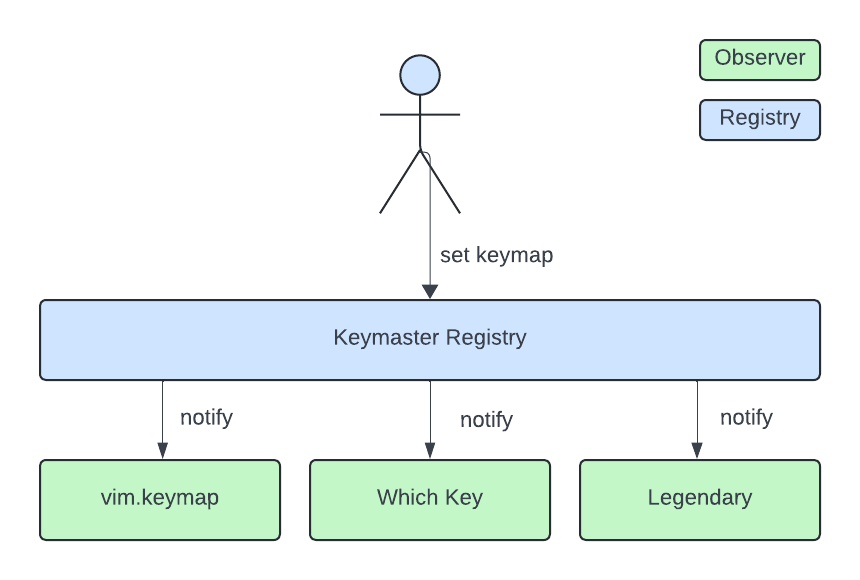

# 🔑 Keymaster.nvim

_The keymapping solution for the modular age._

Keymaster is a Neovim plugin that provides an extendable keymap _registry_. The
_registry_ implements [an observer pattern
interface](https://en.wikipedia.org/wiki/Observer_pattern), which lets
config and plugin authors create cleaner and more maintainable Lua. The
benefits of using Keymaster as the keymapping interface include the following:

- As a Neovim config writer, your keymap observers, like [Which Key] or
  [Legendary], become decoupled. Your [Legendary] setup will not break just
  because you turn off [Which Key].
- As a config writer, you dynamically add or remove keymap observes without
  changing your existing keymaps. A new plugin comes out that indexes keymaps?
  Just add an _observer_ for it.
- As a plugin author, you no longer need to provide specialized integrations to
  all other keymap-related plugins. Just implement a simple _observer_ for your
  plugin.



## ⚡️ Requirements

- Neovim 0.9+
- Optional plugin dependencies:
  - [Legendary]
  - [Which Key]

## 📦 Installation

Install the plugin with your preferred package manager, such as [Lazy]:

```lua
{
  [1] = "gregorias/keymaster.nvim",
  config = true,
}
```

## 🚀 Usage

TODO

[Lazy]: https://github.com/folke/lazy.nvim
[Legendary]: https://github.com/mrjones2014/legendary.nvim
[Which Key]: https://github.com/folke/which-key.nvim
